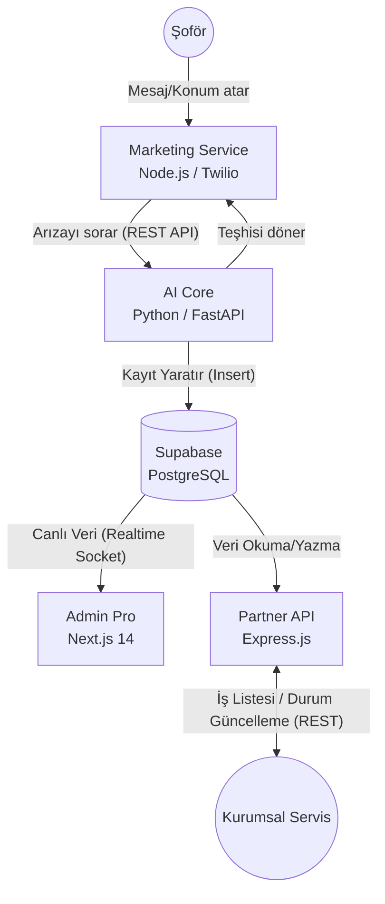

# Bedirhan Panel - Carvis Ekosistem Mimarisi 🚀

Carvis, basit bir mobil uygulamadan çıkarak, farklı platformların ve teknolojilerin birbiriyle konuştuğu devasa bir mikroservis ekosistemine dönüştü. Tüm bu yapının merkezinde **Supabase** yer alıyor.

---

## 🏗️ Servislerin Birbirleriyle Teknik Bağlantısı (Data Flow)

Aşağıdaki şema, kurduğumuz 5 farklı sistemin birbiriyle **nasıl konuştuğunu ve veriyi nasıl pasladığını** göstermektedir.

### Bağlantıların Teknik Detayları:
1. **REST API (HTTP) Bağlantıları:** `Marketing Service` (WhatsApp botu), müşteri ne sorunu olduğunu anlattığında arka planda `AI Core` servisimizin `POST /api/v1/diagnose` adresine bir HTTP isteği atar.
2. **Supabase Client (SDK) Bağlantıları:** Hem Python (AI), hem Express (Partner API) hem de Next.js (Admin) uygulamalarımız veritabanına doğrudan kendi dillerine ait Supabase SDK'ları ile (Örn: `supabase-js`, `supabase-py`) bağlanır. 
3. **WebSockets (Realtime):** Next.js Admin panelimiz, Supabase'e bir *WebSocket* ile bağlanır. Python yapay zekası veritabanına yeni bir arıza kaydı eklediği milisaniye içerisinde, sayfa yenilenmeden Admin panelinin ekranına düşer.

---

## 1. Merkez Üs: Supabase (PostgreSQL) 🗄️
**Nedir:** Sistemin tek ve ortak veritabanıdır. Tüm servislerin buluşma noktasıdır.

**Nasıl Çalışır:**

- `carvis-admin`, `carvis-ai-core`, `carvis-partner-api` ve mobil uygulama dahil HER ŞEY veriyi buradan okur ve buraya yazar.
- Kimlik doğrulama (Kullanıcı girişleri, Partner Token'ları) burada yönetilir.

---

## 2. Kullanıcı Etkileşimi: Marketing Service (WhatsApp Bot) 💬
**Nedir:** Şoförlerin uygulamaya bile girmeden WhatsApp üzerinden Carvis ile konuşmasını sağlayan Node.js botudur.

**Nasıl Çalışır:**

- `Twilio` API kullanılarak WhatsApp ile entegre edilmiştir.
- Arka planda `carvis-ai-core` (Yapay zeka) servisine HTTP isteği atarak müşteriye akıllı yanıtlar döner.

---

## 3. Yönetim ve Raporlama: Carvis Admin Pro (Next.js 14) 📊
**Nedir:** Şirket çalışanlarınızın sistemi yönettiği, istatistikleri ve aktif arıza taleplerini gördüğü web tabanlı gösterge panelidir.

**Nasıl Çalışır:**

- Supabase SSR Middleware sayesinde yetkisiz hiç kimse panele giremez.
- `Supabase Realtime` sayesinde Python veya WhatsApp'tan gelen işler canlı olarak ekrana düşer.

---

## 4. Sistemin Beyni: Carvis AI Core (Python FastAPI) 🧠
**Nedir:** Ekosistemin "Zeka" kısmıdır.

**Nasıl Çalışır:**

- Python'un veri bilimi gücünden yararlanır. 
- Diğer servislerden kendisine gelen (Örn: WhatsApp botundan gelen) şikayet metinlerini analiz edip tanıyı koyar ve doğrudan Supabase'e yazar.

---

## 5. B2B Entegrasyon: Carvis Partner API (Express.js) 🤝
**Nedir:** Kurumsal tamirhanelerin kendi muhasebe veya CRM yazılımlarını Carvis'e bağlayan kapıdır.

**Nasıl Çalışır:**

- `Bearer Token` ile sıkı bir güvenlik duvarı (Helmet, Middleware) ile korunur.
- Partnerler, kendilerine düşen işleri bu API'den çeker ve "Araç Teslim Alındı" gibi statüleri kendi yazılımlarından güncellediklerinde bu API aracılığıyla Supabase'i (ve dolaylı olarak sizin Admin panelinizi) güncellerler.
